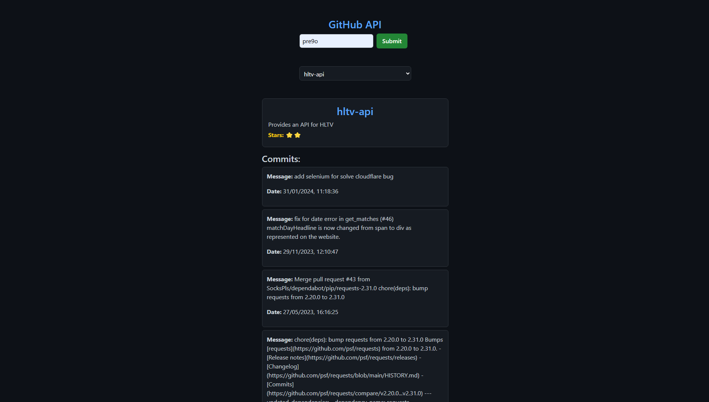

# Projeto2a: GitHub API e DOM Manipulation

#### Deploy

[https://elc1090.github.io/project2a-2025a-Pre9o/](https://elc1090.github.io/project2a-2025a-Pre9o/)

#### Desenvolvedor(a)

Rafael Carneiro Pregardier

#### Ambiente de desenvolvimento

- VS Code

#### Créditos

- [GitHub API Tutorial | 2023](https://www.youtube.com/watch?app=desktop&v=-kFyPaHNgXo&ab_channel=Andy%27sTechTutorials)

#### Bastidores

Para o desenvolvimento do trabalho, primeiro consultei o tutorial que já estava no repositório, para entender como funcionavam as requisições mais básicas. Após essa etapa, busquei o tutorial citado acima para aprender sobre requisições mais elaboradas, métodos de consulta, etc. Por último, apenas dei uma modificada no CSS da página, para que ficasse mais "parecido" com algo oficial do GitHub.

---
Projeto entregue para a disciplina de [Desenvolvimento de Software para a Web](http://github.com/andreainfufsm/elc1090-2025a) em 2025a
